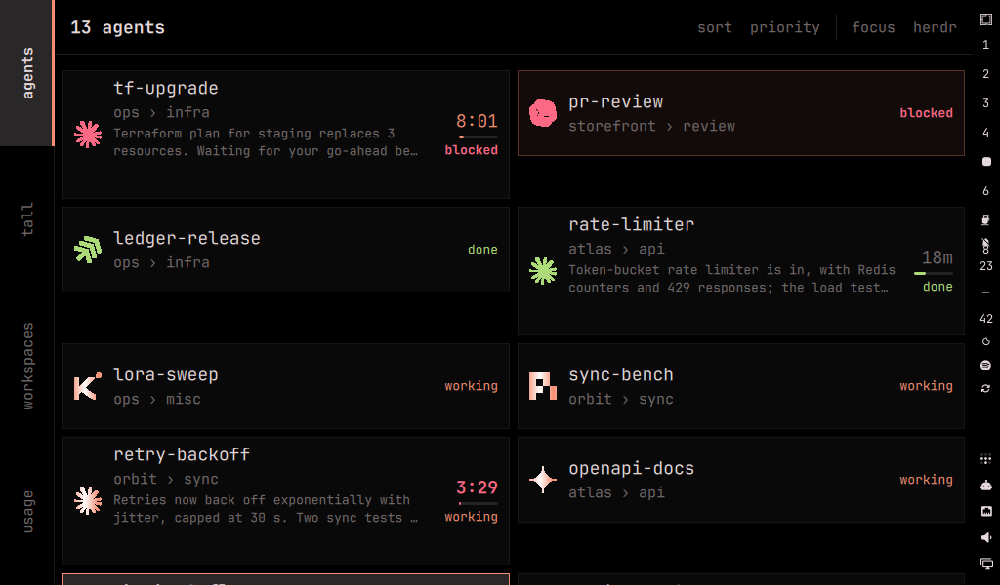
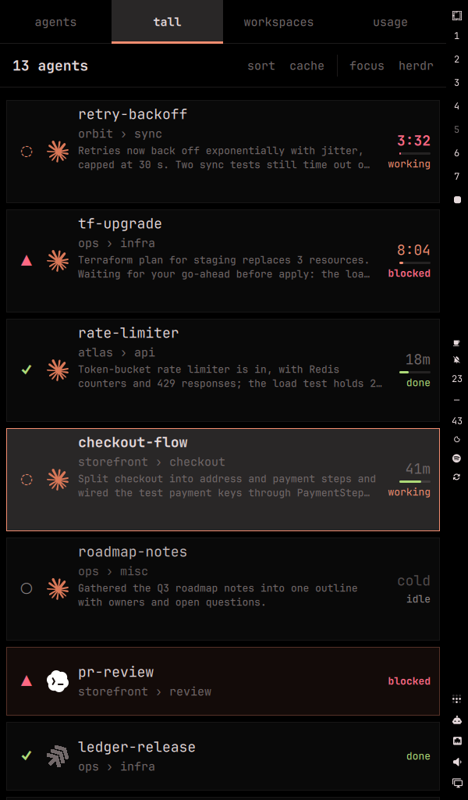

# gjetr


**A herdr dashboard for a secondary touchscreen.** gjetr shows every agent
[herdr](https://herdr.dev) is running as a live Card on a small display next to
your keyboard. Tap a Card to jump to that agent, see at a glance which agents
are blocked or done, and keep an eye on prompt-cache timers, without giving up
screen space on your main monitor for herdr's sidebar.

It is an [Omarchy](https://omarchy.org) shell plugin: it follows your theme,
lives beside the Omarchy bar, and needs no daemon.

<p>
  
  
</p>

## Features

- **Every agent, live.** One Card per herdr agent with its status (a glyph and
  a word that read without colour; the working glyph turns), agent kind,
  a readable name, workspace › tab and, for Claude, the prompt Cache timer
  (`42m`, `4:59`, `cold`). Updates arrive from herdr's event stream within a
  second.
- **Tap to focus.** A tap focuses the exact pane in herdr. Switch Focus
  behaviour to `window` and gjetr also brings the terminal window running herdr
  to the front, on whichever workspace it is.
- **Attention.** When an agent becomes blocked or finishes, its Card pulses in
  your theme's colours until you look at it.
- **Sorting that fits the job.** `spaces` and `priority` match herdr's own
  agent panel; `cache` puts the prompt cache closest to expiring on top. Tap
  the header to cycle.
- **Workspace List.** herdr's workspaces, tabs and panes as a tree that
  expands in place, plain shells included, so any pane is a tap away. Agent
  Lists quietly highlight the agents in herdr's focused workspace.
- **Usage.** Rate limits and usage for Claude, Codex and every other provider
  Omarchy's usage collectors know: meters with time to reset, today's tokens,
  a week of daily bars and tokens by model.
- **Recap.** For Claude agents, the latest session recap Claude Code wrote,
  inline on the Card or on request.
- **Decks of Layouts.** Several Layouts per display, with tabs on a short edge,
  a sideways swipe between them, and badges on tabs you are not looking at.
- **Dock.** Dock gjetr along an edge of your main monitor too, with its own
  Deck: it stays on every workspace, windows tile beside it, ordinary windows
  never cover it, and a keybinding shows or hides it. Works with the mouse.
- **Density that fits.** Touchscreens get big Cards; a Dock and narrow columns
  get compact rows, so a Dock beside your windows lists twenty agents at once.
- **Rotation.** A Layout declares portrait or landscape; on a display you mark
  rotatable, gjetr turns the output and its touch input to match at runtime.
- **Offline-tolerant.** If herdr goes away, the last Cards stay visible, greyed,
  while gjetr reconnects.
- **Themed.** Colours come from the Omarchy theme. Background black, theme,
  wallpaper, or a tinted wallpaper.

## Requirements

- Omarchy 4 with the Quickshell-based Omarchy shell and Hyprland
- [herdr](https://herdr.dev) 0.8.x, running on the same machine
- A second output for the dashboard. It is built for a 7" 1024x600
  touchscreen but works on any output, touch or not
- Optional: the [cache-ttl](https://github.com/nytafar/herdr-cache-ttl) herdr
  plugin, for Cache timers and the `cache` Sort mode
- Optional: [Claude Code](https://claude.com/claude-code) agents in herdr, for
  the Recap Field

gjetr has no other dependencies. It uses `hyprctl`, `ps`, `find`, `stat`,
`grep` and, for the Usage Module, `omarchy-agent-usage-update`, all of which
Omarchy already ships.

## Install

```bash
omarchy plugin add https://github.com/nytafar/gjetr.git --enable
```

gjetr then appears on `HDMI-A-2`. To use another output, create a Config (below)
and set its name.

Update with `omarchy plugin update nytafar.gjetr`.

### Remove

```bash
omarchy plugin remove nytafar.gjetr
```

gjetr never writes your Config. Removing the plugin leaves
`~/.config/gjetr/` (your Config, if you made one) and
`~/.local/state/gjetr/state.json` (on-screen choices). Delete them if you like.

## Quickstart

Create `~/.config/gjetr/gjetr.toml`:

```toml
[[display]]
name = "HDMI-A-2"          # your output, from `hyprctl monitors`
deck = ["agents"]
```

and `~/.config/gjetr/layouts/agents.toml`:

```toml
orientation = "landscape"

[[module]]
type = "agent-list"
sort = "priority"          # spaces | priority | cache
preset = "detailed"        # detailed | compact
focus = "window"           # herdr | window
recap = "inline"           # off | inline | expand
```

Changes apply as soon as you save. Commented examples of every key are in
[`examples/gjetr/`](examples/gjetr), and the full reference is in
[docs/CONFIGURATION.md](docs/CONFIGURATION.md).

A two-Layout Deck that rotates the panel:

```toml
# gjetr.toml
[[display]]
name = "HDMI-A-2"
deck = ["wide", "tall"]
rotatable = true

# layouts/wide.toml: orientation = "landscape"
# layouts/tall.toml: orientation = "portrait"
```

### On the display

| Touch | Does |
|---|---|
| Tap a Card | Focus that agent |
| Tap the header | Next Sort mode |
| Tap `focus` in the header | Switch Focus behaviour between `herdr` and `window` |
| Tap a tab, or swipe sideways | Change Layout |
| Tap a workspace or tab row | Open or close it (`tap = "expand"`), or focus it in herdr (`tap = "focus"`, where the chevron opens it) |
| Tap a pane row | Focus that pane, agent or shell |
| Tap the Usage header | Refresh usage now |
| Tap `recap` on a Card, or long press | Open or close the full Recap in the Card, or over the list with `recap_open = "overlay"` (with `recap = "expand"`) |

These choices are remembered until you reset them with
`omarchy-shell nytafar.gjetr resetOverrides`.

## Touchscreen setup

Out of the box Hyprland spreads a touchscreen across all monitors, so taps on
the panel land on your main screen. Bind the touch device to its output in
`~/.config/hypr/input.lua`:

```lua
hl.device({ name = "wch.cn-usb2iic_ctp_control", output = "HDMI-A-2" })
```

Find the device name with `hyprctl devices -j | jq .touch`. Some controllers
re-enumerate with a `-1` suffix after a replug; bind both names.

If the display is `rotatable`, gjetr also rotates touch input when it rotates
the output. To limit that to specific touchscreens, list them in
`touch_devices` (see [Rotation and touch](docs/CONFIGURATION.md#rotation-and-touch)).

## Troubleshooting

Everything gjetr does is logged with a `[gjetr]` prefix, and its whole state is
one command away:

```bash
journalctl --user -f | grep gjetr
omarchy-shell nytafar.gjetr state | jq
```

| Symptom | Check |
|---|---|
| Nothing on the display | `state` → `displayPresent`. The name in `[[display]]` must match `hyprctl monitors` exactly |
| "herdr offline, retrying" | Is herdr running? `state` → `herdr.socket` must be the socket `herdr status server` reports |
| Config seems ignored | `state` → `config.errors` names the file, line and key that fell back to a default |
| Taps land in the wrong place | Bind the touch device to the output (above). After a rotation, see `state` → `deck.touch` |
| No Cache timers | The cache-ttl herdr plugin is not installed, or the agent is not Claude |
| No Recap | `recap` is `off`, the agent is not Claude, or Claude has not written a recap for that session yet. `state` → `recap` shows sessions found and read |
| Focus behaviour `window` does nothing | `state` → `windowFocus.error`. herdr must run in a terminal window on this desktop, not over `--remote` |
| Content under the bar | Report it, with `state` → `bar` |
| Changes to gjetr's code do not show | Run `omarchy-restart-shell`; a plugin rescan keeps the old code loaded |

## How it works

gjetr is a Quickshell service inside the Omarchy shell. It keeps one
subscription to herdr's socket, uses events only to decide when to take a fresh
snapshot, and draws a Bottom-layer surface on the configured output. All logic
is plain JavaScript with node tests; QML only draws.

Every process gjetr starts is checked against a fixed allowlist and run without
a shell. The only things it changes outside its own state file are a runtime
output transform and touch transform on a display you mark `rotatable`, and
window focus when you tap with Focus behaviour `window`.

## Roadmap

- Client mode: work in a herdr pane on the display when the desk is away
- Long-press actions on Cards
- Several herdr servers at once

## Credits

gjetr lifts small patterns, with thanks, from MIT-licensed Omarchy plugins:

- [OmaDeck](https://github.com/TheAirick/OmaDeck), Copyright (c) 2026 Erik
  Holum: the service-owns-surface shape with hotplug re-registration, the
  layer-shell surface configuration, and running QML libraries under node.
- [omarchy-herdr](https://github.com/carlotran4/omarchy-herdr), Copyright (c)
  2026 Carlo Tran: the two-socket herdr connection shape.
- [lacuna-shell](https://github.com/OldJobobo/lacuna-shell), Copyright (c) 2026
  Lacuna Omarchy Plugins contributors: selecting a screen by output name.

Bundled: [toml.min](https://github.com/wellwelwel/toml.min) 1.0.0, Copyright
(c) 2026-present Weslley Araújo (MIT), in `lib/vendor/toml.js` with its licence
header.

The idea of finding herdr's terminal window by walking the process tree comes
from [omaherdr](https://github.com/njpatel/omaherdr) (Apache-2.0); no code from
it is used. Kind marks are read in place from Omarchy's agents plugin.

## License

[MIT](LICENSE) © nytafar
